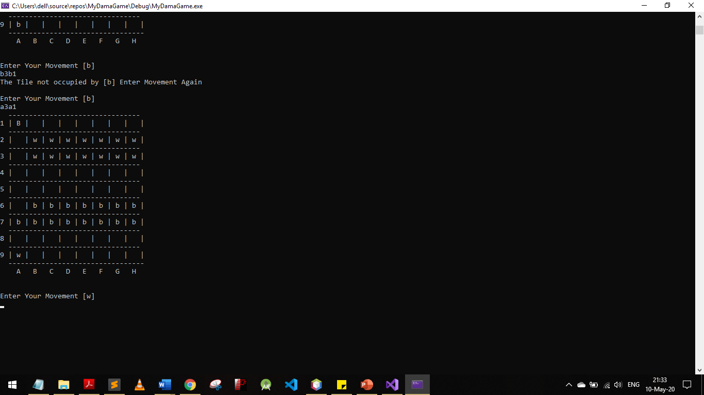
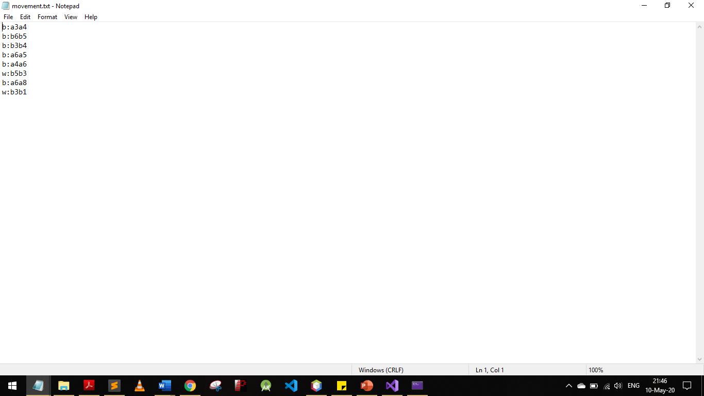

# Checker-Chess-Game-c++

Checker Game in c++
We Save All The Moves And Game Board in Random Access File
and We save players' steps in Text File

![Game Board Srored in Random Access File] 

![Steps Stored in Text File] ![Screenshot] 

![Steps Stored in Text File] ![Screenshot] 
